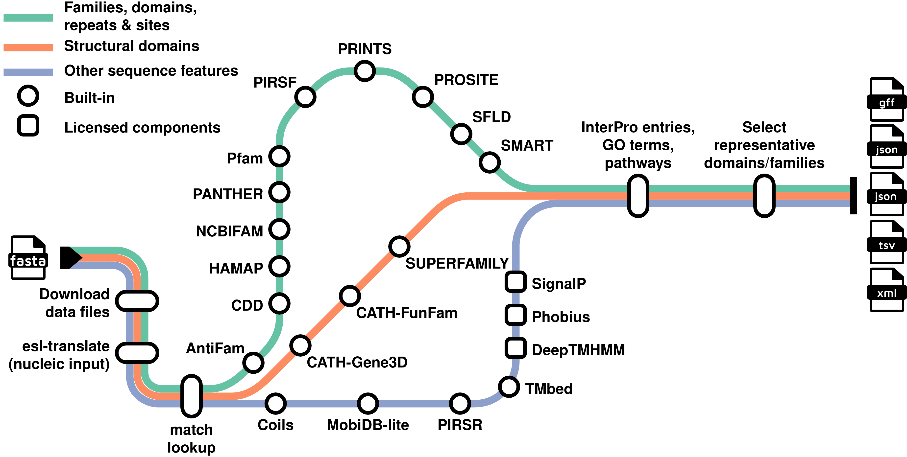

# InterProScan

[InterPro](http://www.ebi.ac.uk/interpro/) is a database that brings together predictive information on protein function from multiple partner resources. It provides an integrated view of the families, domains and functional sites to which a given protein belongs.

InterProScan is the command‑line designed to scan protein or nucleotide sequences against the InterPro member‑database signatures. Researchers with novel sequences can use InterProScan to annotate their data with family classifications, domain architectures and site predictions.

InterProScan 6 is the new implementation of InterProScan, built using [Nextflow](https://www.nextflow.io/), a workflow system for creating scalable, portable, and reproducible pipelines.



## Get started

To get a first successful run:

1. Install [Nextflow](https://www.nextflow.io/) `25.10.4` or later.
2. Install a supported container runtime such as [Docker](https://www.docker.com/), [SingularityCE](https://sylabs.io/singularity/), or [Apptainer](https://apptainer.org/).
3. Run the following command

```bash
nextflow run ebi-pf-team/interproscan6 \
  -r 6.0.1 \ # (1)!
  -profile docker,test \ # (2)!
  --datadir data \ # (3)!
  --interpro latest # (4)!
```

1. Specifies the version of InterProScan to run. We **strongly recommend** always specifying a version to ensure consistent and reproducible results.
2. Configuration profiles: `docker` executes tasks in Docker containers, and `test` uses a small test FASTA file included in the workflow.
3. Sets the `data` directory as the location to store InterPro and member database files. The directory will be created automatically if it doesn't exist, and required files will be downloaded into it.
4. Uses the latest available InterPro data release.

After the test run, you should see five new files in your current working directory:

- `test.faa.gff3`
- `test.faa.json`
- `test.faa.jsonl`
- `test.faa.tsv`
- `test.faa.xml`

Once the test succeeds, move on to [Running InterProScan](usage.md) and annotate your own sequences.

## Support

For further assistance, please [create an issue](https://github.com/ebi-pf-team/interproscan6/issues) or [contact us](http://www.ebi.ac.uk/support/interproscan).

## License

InterProScan 6 is released under the Apache 2.0 License.

## Citations

If you use InterProScan in published work, please cite:

- Blum M, Andreeva A, Florentino LC, Chuguransky SR, Grego T, Hobbs E, Pinto BL, Orr A, Paysan-Lafosse T, Ponamareva I, Salazar GA, Bordin N, Bork P, Bridge A, Colwell L, Gough J, Haft DH, Letunic I, Llinares-López F, Marchler-Bauer A, Meng-Papaxanthos L, Mi H, Natale DA, Orengo CA, Pandurangan AP, Piovesan D, Rivoire C, Sigrist CJA, Thanki N, Thibaud-Nissen F, Thomas PD, Tosatto SCE, Wu CH, Bateman A. **InterPro: the protein sequence classification resource in 2025**. *Nucleic Acids Res*. 2025 Jan;53(D1):D444-D456. doi: [10.1093/nar/gkae1082](https://doi.org/10.1093/nar/gkae1082).

