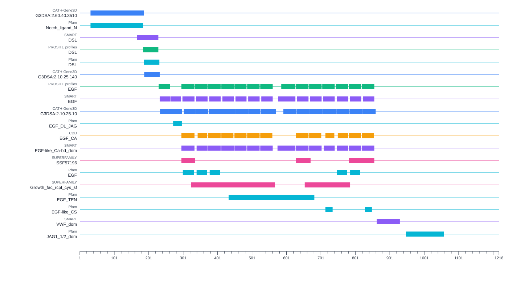
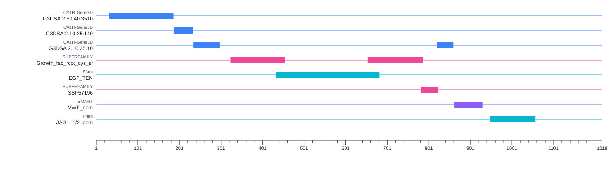

# Representative domains & families

## Overview

InterProScan often reports several overlapping member-database signatures for the same region of a protein, especially for domains. This is biologically useful because different databases may recognise the same feature in different ways, but the full result can be difficult to read at a glance. To make protein architectures easier to interpret, InterProScan automatically marks a representative subset of domain and family matches during a standard run.

/// caption
All domains found in [JAG1_MOUSE](https://www.uniprot.org/uniprotkb/Q9QXX0/entry)
///

Representative matches provide a simplified view of the results, intended to highlight the main domain or family architecture of a protein without showing every overlapping signature. This is most useful for domains. For families, the value is often lower because family matches frequently describe most or all of the sequence rather than a local region.

/// caption
Representative domains in [JAG1_MOUSE](https://www.uniprot.org/uniprotkb/Q9QXX0/entry), giving a cleaner architecture summary
///

!!! info

    Representative selection does not remove matches from the output. All matches and locations are still reported. In JSON, XML, and GFF3 output, representative locations are marked with `representative=true`, while other reported locations are marked with `representative=false`.

    If you run InterProScan with `--skip-repr-locations`, all matches are still reported, but `representative` is set to `false` for every location.

## How representatives are selected

Representative selection follows a simple principle: choose a small set of matches that summarizes the protein architecture while avoiding strong redundancy.

1. Candidate domain or family matches are considered for representative selection. # TODO: expand, what are candidates, how are some candidates and some are not?
2. Matches that occur in the same region of the protein are grouped together.
3. Within each overlapping group, InterProScan looks for a combination of matches that covers as much of the sequence as possible without keeping several strongly redundant annotations.
4. Matches that do not overlap with any alternatives are kept automatically.

In practice, this means the representative view is designed to retain the main biological signal of the architecture while suppressing repeated annotations of essentially the same region.
